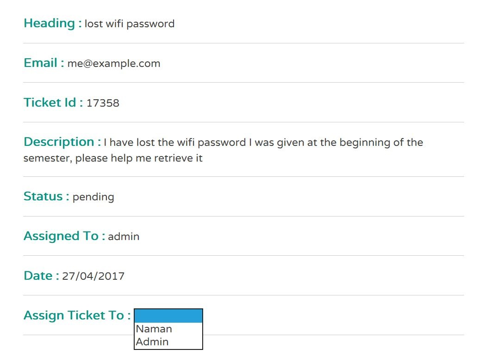

# Helpdesk

Welcome to Helpdesk, this is a demo application for my project to build a helpdesk for the university intranet portal. Below you will find a complete tutorial what the application does and how to run it
on your computer

1. [How it works](https://github.com/namkam5/helpdesk#how-it-works)
2. [How to run the application](https://github.com/namkam5/helpdesk#how-to-run-the-app)


## How it works
### Client Side
<br />

the front page when you start the demo at ```127.0.0.1:3000 ```
<br />


<br /><br />

This is the first page you see when you start the demo. Here the client is supposed to enter a query, their email and a description of what the problem they are facing is and then hit submit

As soon as they hit submit they will get a ticket number as shown below.
<br /><br />

<br /><br />
This is supposed to be noted by the client for future reference as they will be able to access details to their query using this number

### Admin Side

Shown below is the administrator dashboard this is where the administrator is able to see all the queries / tickets that have been issued. Here the admin will be able to visit each ticket's individual page and further assign the given task to its respective department

<br />
<br />
This is how our admin page will look like, This is where all the queries go, All the headings are hyperlinks to the issue page shown below where the admin can also assign the query to other departments, in the image you can see the assigned to tab which shows, who the query is assigned to.

<br />

This is where admin will see the ticket details and be able to assign the tickets to the respective departments as shown. The ticket details page for the client will be exactly the same except they won't be able to change who the ticket is assigned to

Note that the URL for the ticket page is set to ``` http://127.0.0.1:3000/tickets/17358 ``` for convenience. This helps the admin directly visit the ticket page by accessing the ticket number

## How to run the App

### Install MongoDB

To run the app the prerequisite is you need to have MongoDB installed on your machine. If you don't have MongoDB installed, please visit their official [installation page](https://docs.mongodb.com/manual/installation/) and follow the instructions depending on the platform you're on.

### Install NodeJS

This app is built with Node and Express so that is also a prerequisite for to run the application. If you don't already have NodeJS installed you can visit their [installation page](https://nodejs.org/en/download/) and follow the instructions depending upon the server you are running.

### Run the app

This is the simplest part, **cd into the directory** and start the mongodb server
by typing

 ```
 sudo service mongodb start
 ```
if you are on linux or equivalent on other platforms.

Once you have started the mongodb server, the next step is to run the app itself we do this by typing

```
node serve
```
you should then recieve something like this in the terminal

```
listening on port 3000
successfully connected to the database
```
you can now then visit the application at ```127.0.0.1:3000```
