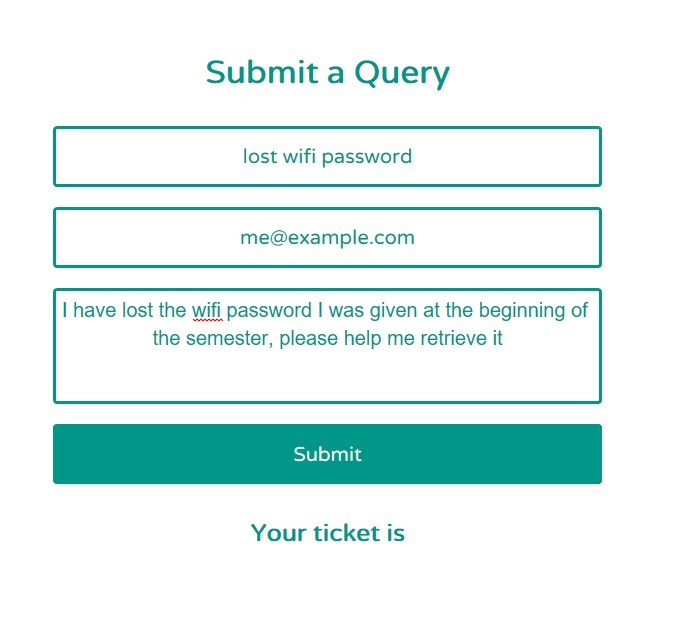
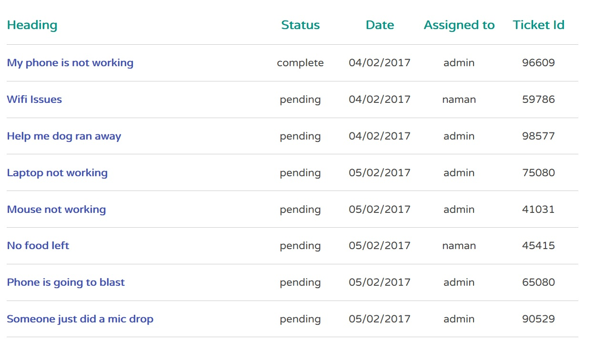

# Helpdesk

Welcome to Helpdesk, this is a demo application for my project to build a helpdesk for the university intranet portal.

Below you will find a complete tutorial what the application does and how to run it
on your computer

## How it works
### Client Side
 

  

This is the first page you see when you start the demo. Here the client is supposed to enter a query, their email and a description of what the problem they are facing is and then hit submit

As soon as they hit submit they will get a ticket number as shown below.
  

  
This is supposed to be noted by the client for future reference as they will be able to access details to their query using this number

### Admin Side

Shown below is the administrator dashboard this is where the administrator is able to see all the queries / tickets that have been issued. Here the admin will be able to visit each ticket's individual page and further assign the given task to its respective department

 
 
This is how our admin page will look like, This is where all the queries go, All the headings are hyperlinks to the the issue page shown below where the admin can also assign the query to other departments, in the image you can see the assigned to tab which shows, who the query is assigned to.
 

 

This is where admin will see the ticket details and be able to assign the tickets to the respective departments as shown. The ticket details page for the client will be exactly the same except they won't be able to change who the ticket is assigned to
